# Data Science Research and Development Laboratory
[](https://opensource.org/licenses/MIT)


Інноваційна платформа для досліджень та експериментів у сфері машинного навчання

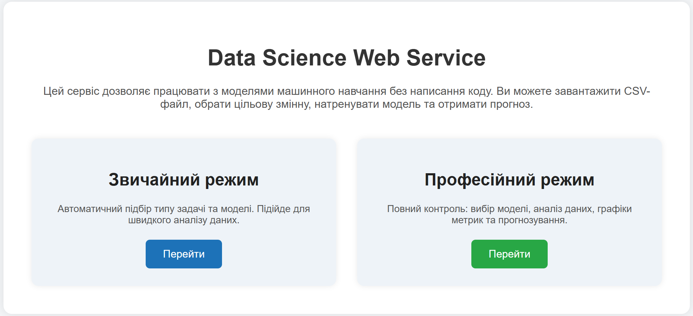

## 🚀 Data Science Lab
Аналіз • Моделі • Прогноз

- 📊 Регресія  
- 🔍 Класифікація  
- 🌀 Кластеризація  

---

## ⚡ Звичайний режим
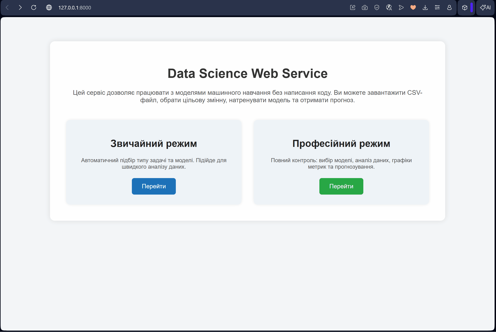

### 🌀 Кластеризація
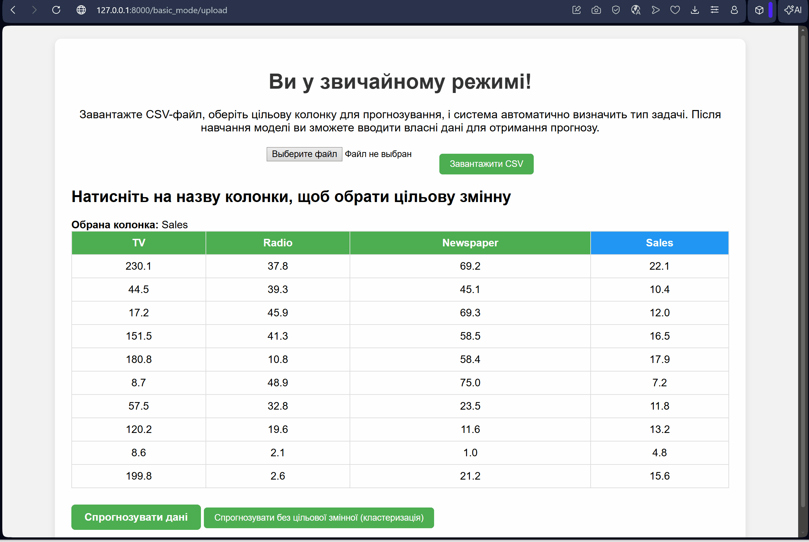

---

## 🎯 Професійний режим


### Завантаження CSV → Цільова змінна → Тип задачі
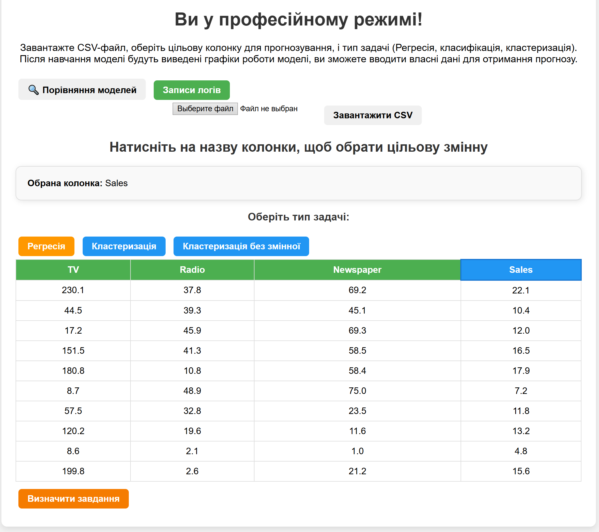

### ⚙️ Вибір моделі + параметри
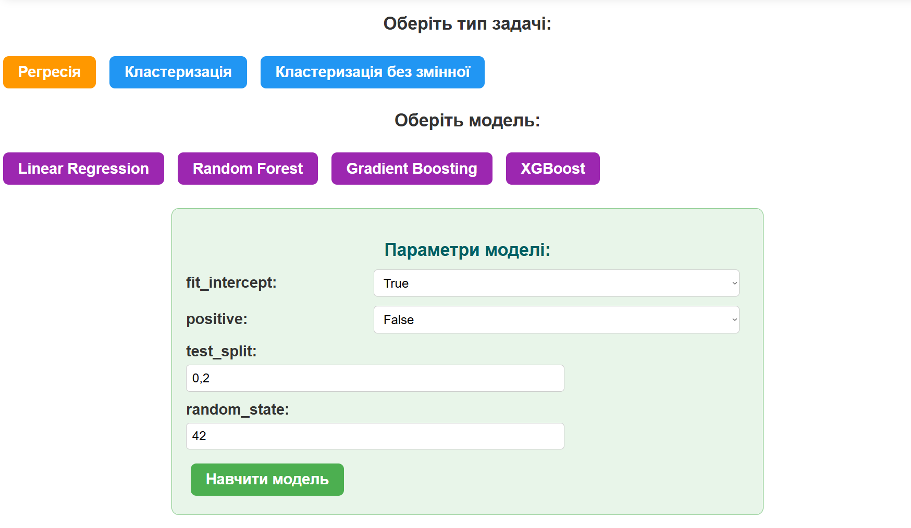

### 📊 Повна інформація + графіки
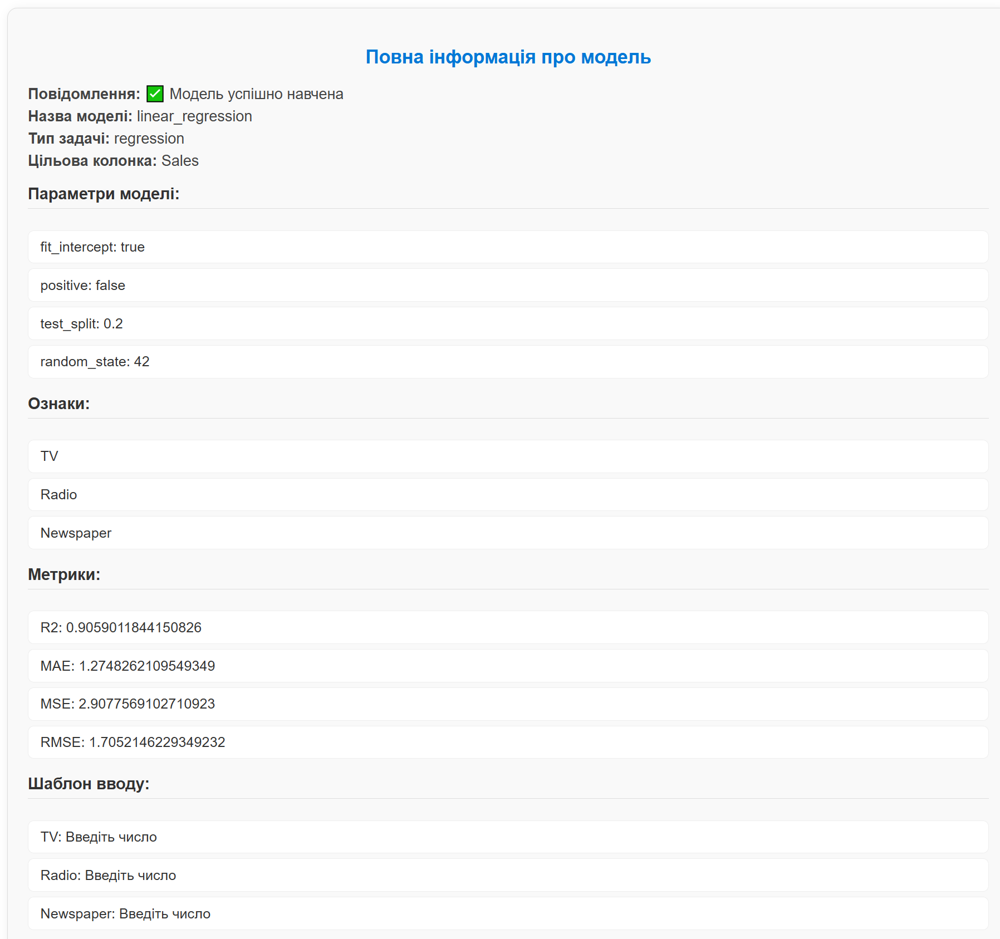  
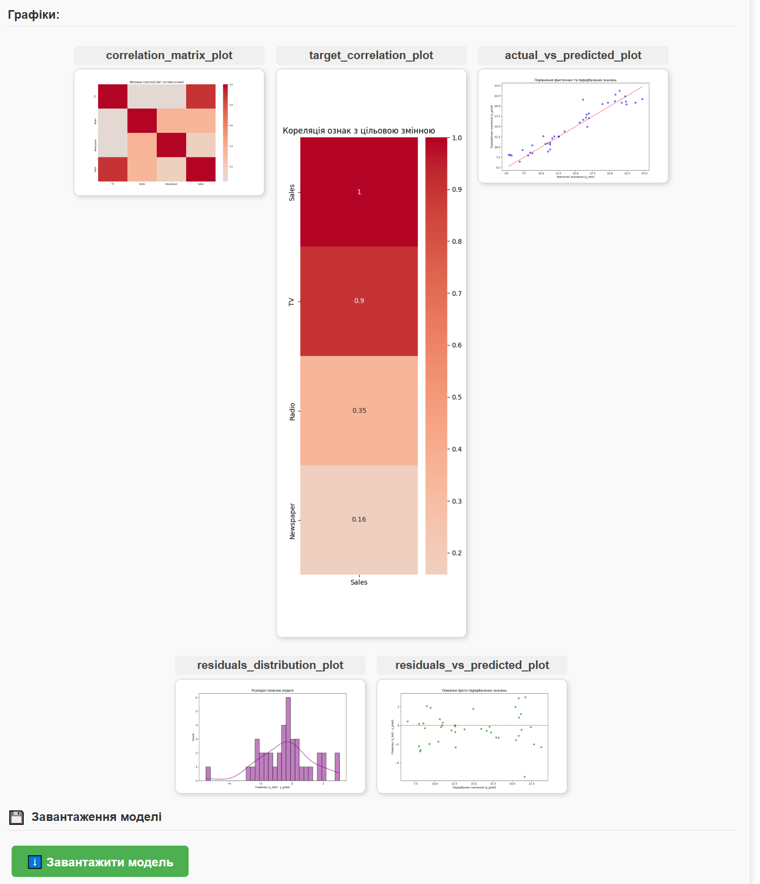

### 🔮 Прогноз + PDF звіт
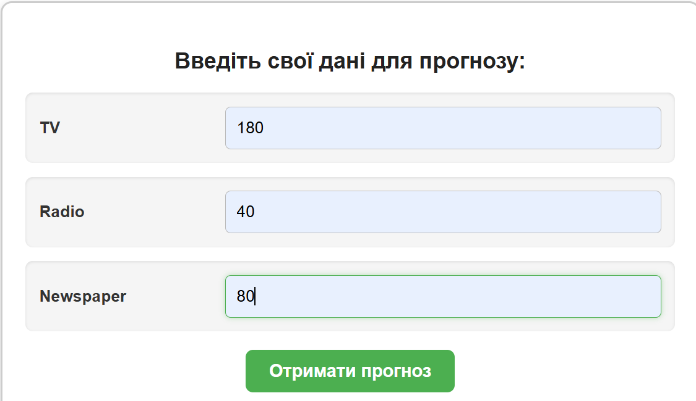  
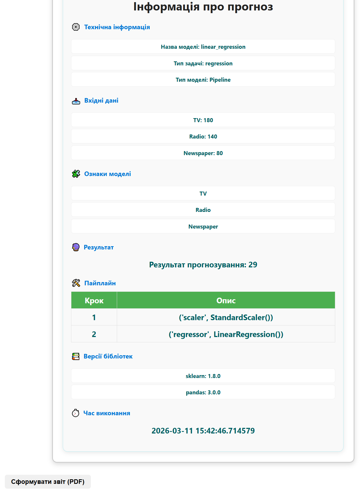

### 📝 Логи та порівняння моделей
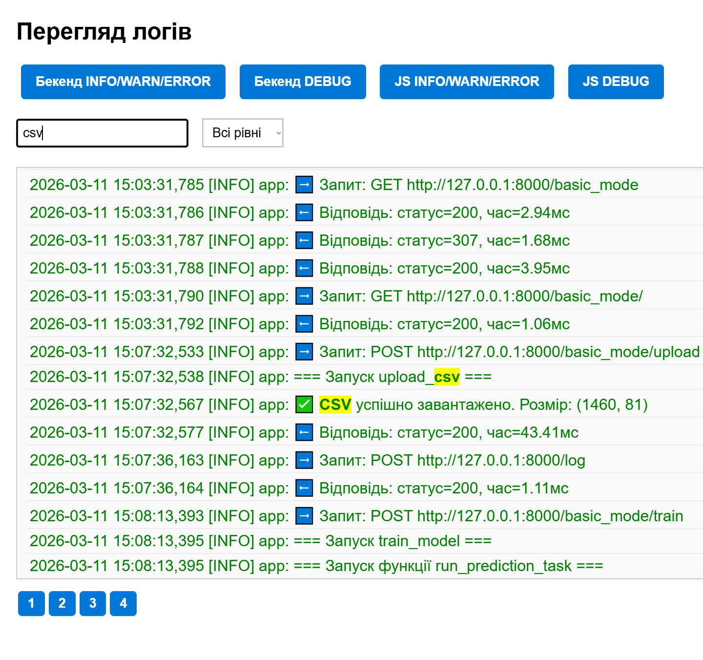  
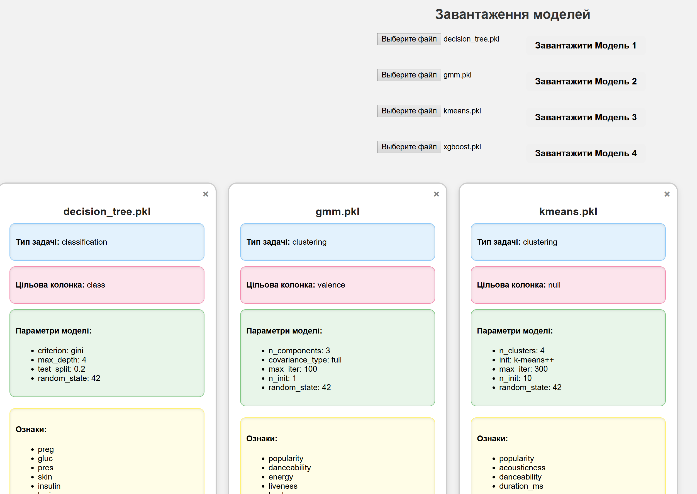  
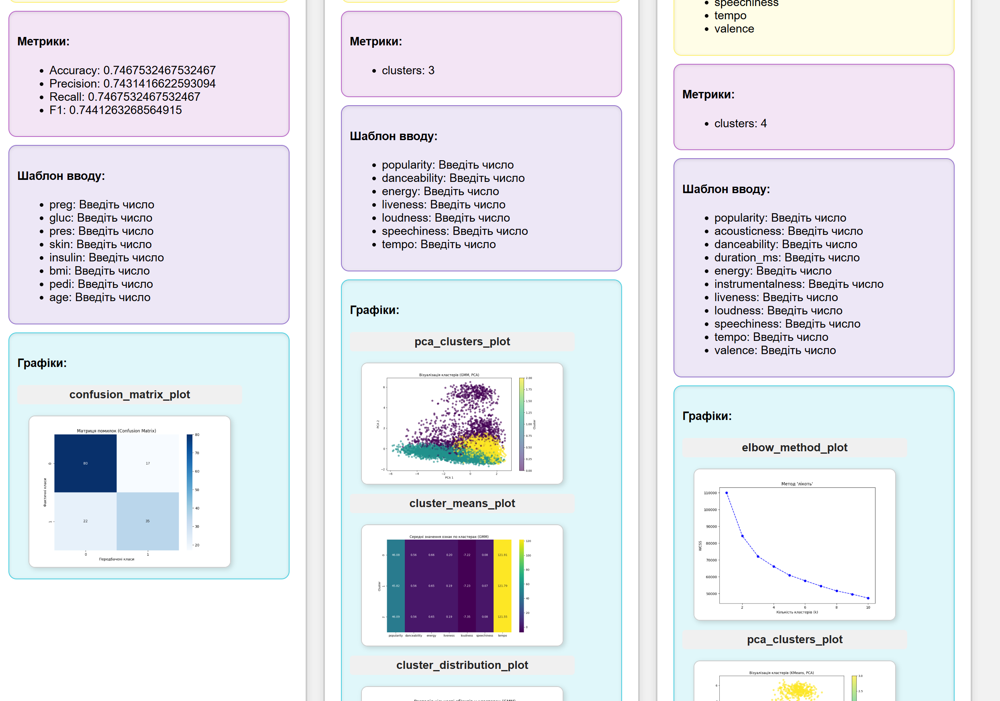

---

## 📊 Порівняння моделей


---

## 📝 Логи


---

## 🎓 Призначення платформи
Дослідження • Прототипи • Аналіз • Навчання • Демонстрація

---


## 🚀 Запуск платформи

1. Склонуйте репозиторій:
   ```bash
   git clone https://github.com/username/repository.git
    ```
   
2. Перейдіть у папку проекту:
   ```bash
   cd repository
    ```
3. Встановіть залежності:
    ```bash
   pip install -r requirements.txt
   ```

4. Запустіть сервер:
    ```bash
   uvicorn main:app --reload
   ```
