# R&D Documentation

 
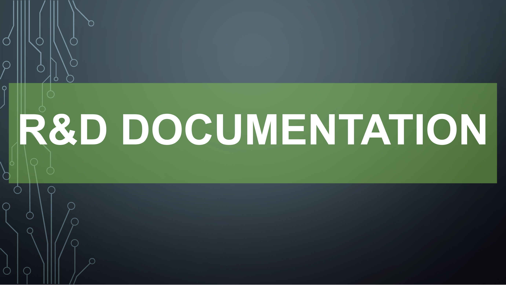

 
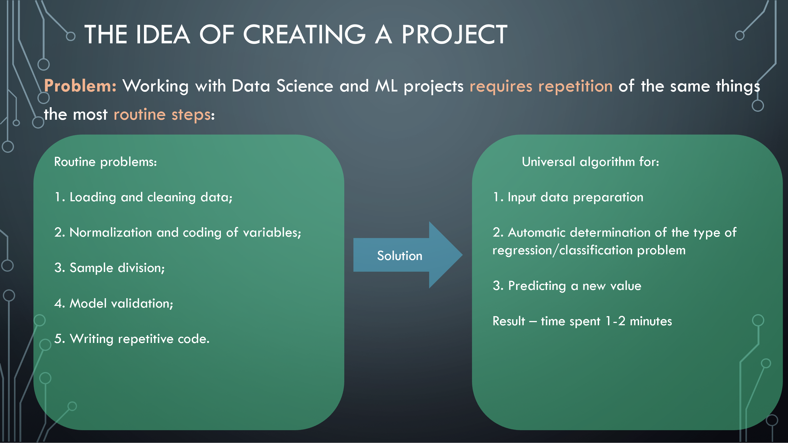

 
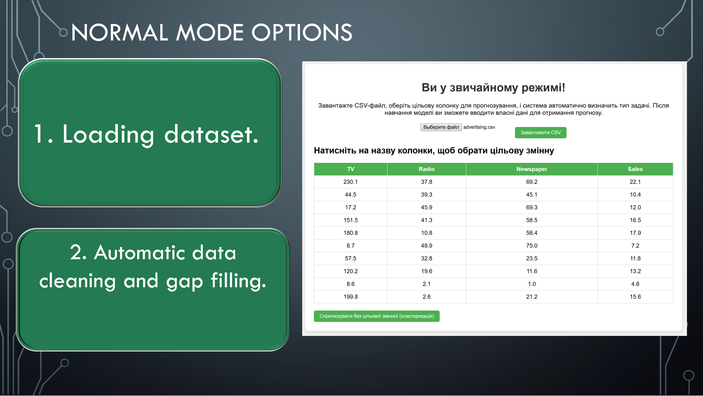

 
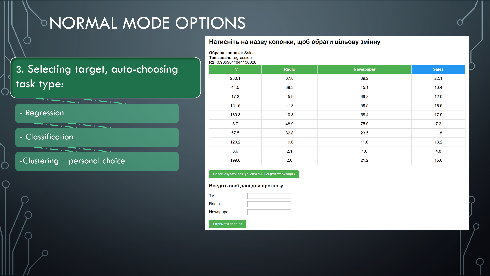

 
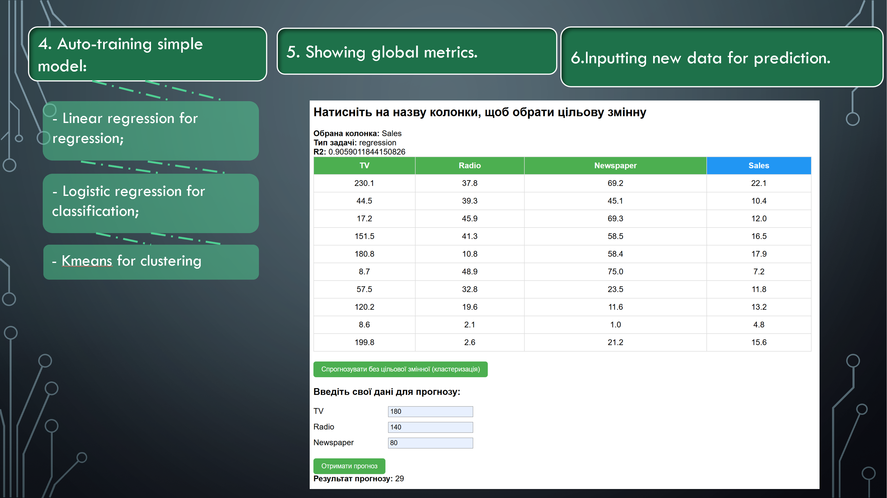

 
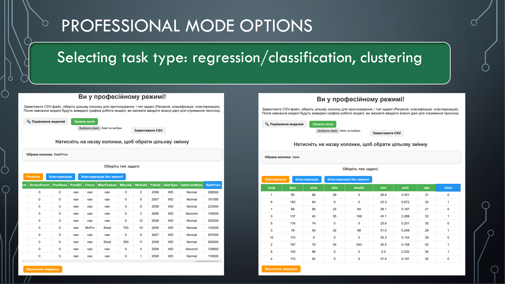

 
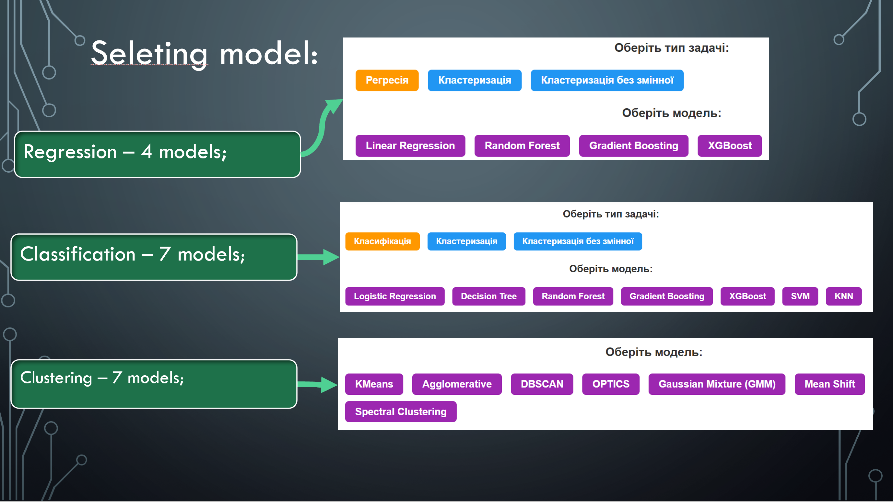

 
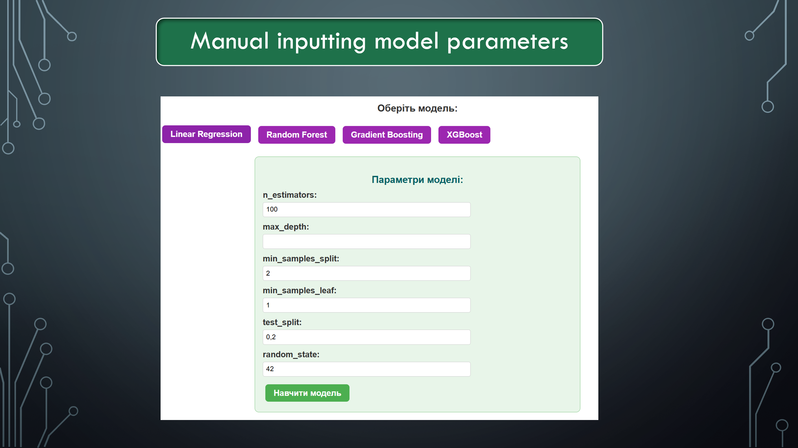

 
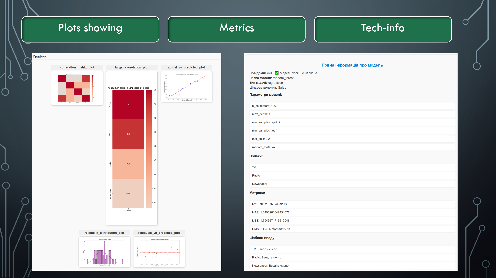

 
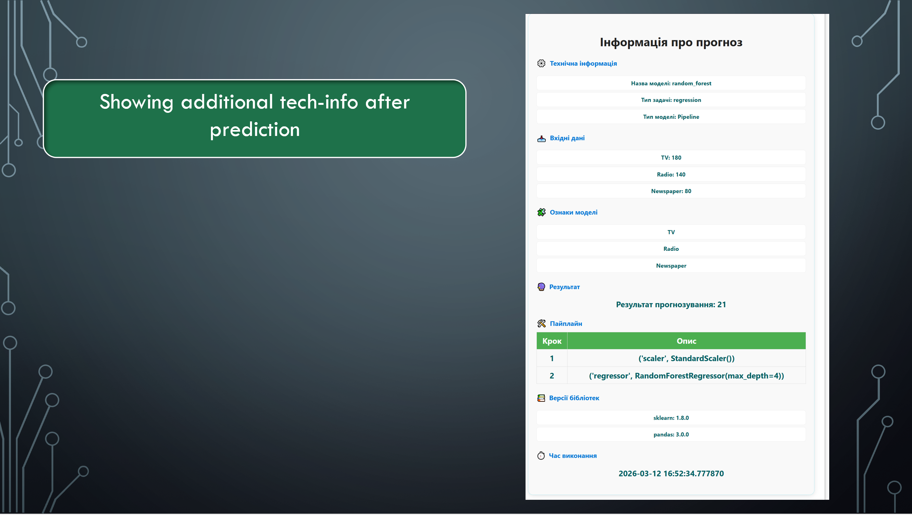

 
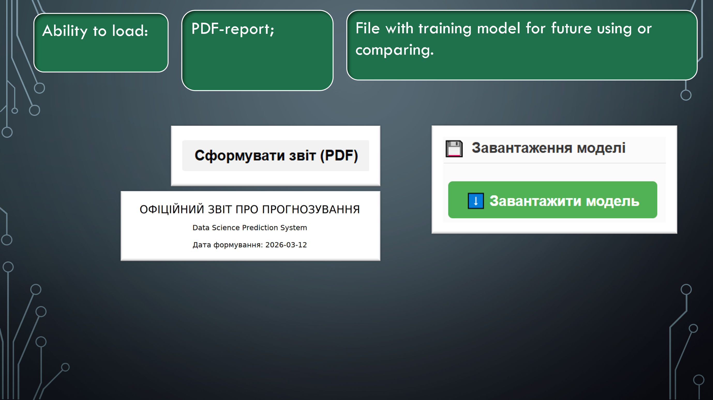

# Project architecture

The service is built in the form of a modular structure, which allows you to easily scale and add new algorithms, models and functionality.

## Main components

### 1. Fonts
- **fonts/** — contains fonts for the web interface.

### 2. Logs
- **logs/** — log files for backend (Python) and frontend (JavaScript):
- `app_debug.log` — Python debug logs;
- `app_info.log` — general Python logs (info, warn, error);
- `js_debug.log` — JavaScript debug logs;
- `js_info.log` — general JavaScript logs (info, warn, error).

The logging system allows you to track errors and the state of the service at any stage.

### 3. Routers
- **routers/** — FastAPI routers:
- `basic_router.py` — routes for normal mode;
- `router_professional.py` — routes for professional mode.

### 4. Saved models
- **saved_basic_models/** — models for normal mode.
- **saved_models/** — models for professional mode.
- **uploaded_models/** — models uploaded by the user for comparison.

### 5. Static files
- **static/** — JS and CSS files for the web interface:
- scripts for different modes;
- styles for pages;
- `favicon.svg` — browser icon.

### 6. HTML templates
- **templates/** — HTML templates for the web interface:
- `basic/` — templates for the regular mode;
- `professional/` — templates for the professional mode;
- `main_index.html` — main page.

### 7. Algorithms for the professional mode
- **TEST_PROF_ALGRS/** — algorithm modules:
- **classification_algs/** — 7 classification models: Decision Tree, Gradient Boosting, KNN, Logistic Regression, Random Forest, SVM, XGBoost.
- **regression_algs/** — 4 regression models: Linear Regression, Random Forest Regressor, Gradient Boosting Regressor, XGBoost Regressor.
- **clustering_algs/** — 7 clustering algorithms: Agglomerative, DBSCAN, GMM, KMeans, Mean Shift, OPTICS, Spectral Clustering.

### Central files in each subfolder

#### main.py
- Responsible for centralized launch of model training for the corresponding type of task.
- Performs:
- automatic data processing;
- launch of the selected model with parameters;
- training and validation management;
- saving the trained model to the corresponding folder.
- The goal is to avoid code duplication for different models of the same type of task.

#### utils.py
- Contains common functions and algorithms used by all models in the subfolder:
- preparation and cleaning of the dataset;
- coding of categorical variables;
- data normalization/scaling;
- separation into training and test sets;
- construction of training graphs and metrics;
- saving the model in the pipeline;
- generation of training reports.

> `utils.py` ensures data processing consistency and code reuse without duplication.

Additionally:
- **csv_tables/** — CSV examples for testing.
- **start_task_detector.py** — definition of the task type.

### 8. Training models in normal mode
- **training/**:
- `task_detector.py` — definition of the task type;
- `train_classification.py` — classification training;
- `train_clustering.py` — clustering training;
- `train_regression.py` — regression training.

### 9. Logger configuration
- **logging_config.py** — configuration of Python and JavaScript loggers.

### 10. Central launch
- **main.py** — the main FastAPI service launch file, responsible for connecting routers, initializing models, and launching the web service.

### 11. Documentation and instructions
- **README.md** — general description of the service.
- **MANUAL.md** — user manual.
- **RND_DOCUMENTATION.md** — R&D documentation with technical details.
- **requirements.txt** — project dependencies.

# Technical part
## Main router (main.py)

## Purpose
Central entry point to the service. Responsible for:
- creating a FastAPI application;
- connecting static files and HTML templates;
- connecting routers (regular and professional mode);
- logging each web request;
- displaying the main page;
- receiving messages for logging from the frontend.

## Main components
- **FastAPI** — application initialization.
- **StaticFiles / Jinja2Templates** — work with static files and templates.
- **basic_router / professional_router** — connecting modes.
- **logger / js_logger** — logging system for Python and JavaScript.

## Logic
1. User goes to `/` → `main_index.html` is returned.
2. Requests go through middleware → method, URL, status, execution time are logged.
3. Frontend calls to `/log` → recording messages in `js_logger`.
4. Further work occurs through:
- `basic_router` → normal mode;
- `professional_router` → professional mode.

## Normal mode router (basic_router.py)

## Purpose
The router is responsible for work in **Basic Mode**:
- loading a dataset (CSV);
- automatic task definition and training a simple model;
- perform predictions for new data;
- display results in the web interface.

## Main components
- **APIRouter** with the prefix `/basic_mode`.
- **templates/basic/** — HTML templates for the interface.
- **basic_state** — global state (data, model, task type, target variable).
- **run_prediction_task** — function for automatic task definition and model training.
- Models used: `LinearRegression`, `LogisticRegression`, `KMeans`.

## Logic
1. **`GET /basic_mode/`**
- Displays the main page of the mode.

2. **`POST /basic_mode/upload`**
- Upload CSV file.
- Check format.
- Save dataset in `basic_state`.
- Display table preview and column types.

3. **`POST /basic_mode/train`**
- Call `run_prediction_task`.
- Train the model (regression, classification, clustering).
- Save the model and parameters in `basic_state`.
- Output metrics and graphs.

4. **`POST /basic_mode/predict-value`**
- Use the trained model to predict new data.
- For classification — also returns class probabilities.
- For clustering — determines the object cluster.

`basic_router.py` implements the full cycle of work in normal mode:
**data loading → model training → predicting new values**.

## Task type determination (task_detector.py)

## Purpose
The file is responsible for automatically determining the type of prediction task:
- clustering (if the target variable is not specified);
- classification (numeric variable with few unique values ​​or categorical variable);
- regression (numeric variable with many unique values).

## Main components
- **run_prediction_task** — main function to run the task.
- Uses modules:
- `train_regression_model` — regression training;
- `train_classification_model` — classification training;
- `train_cluster_model` — clustering training.
- **logger** — process logging.

## Logic
1. If `df` is not passed → reads the dataset from the file.
2. If `target` is not specified → starts clustering.
3. If `target` is missing from the columns → error.
4. Determines the data type of the target variable and the number of unique values:
- numeric variable ≤ 10 unique values ​​→ classification;
- numeric variable > 10 unique values ​​→ regression;
- categorical variable → classification.
5. Calls the appropriate training function.

`task_detector.py` is a key module for automatically selecting the type of task and starting the appropriate training process.

## Training the regression model (train_regression.py)

## Purpose
The file implements the training process of the **LinearRegression** model in the usual mode:
- data preprocessing;
- selection of important features;
- model training;
- calculation of metrics;
- plotting;
- formation of an input template for the user.

## Main components
- **LinearRegression** — basic regression model.
- **Pipeline (StandardScaler + LinearRegression)** — scaling and training.
- **Metrics**: R2, MAE, MSE, RMSE.
- **Graphs**: correlation matrix, feature correlation with target, actual vs predicted, error distribution, errors vs predicted.
- **prepare_user_input** — function to convert user input to DataFrame format.
- **input_template** — automatically generated input template.
- **Save model** to `saved_basic_models/linear_model_pipeline.pkl`.

## Logic
1. Filling gaps and encoding variables.
2. Building correlation matrix and feature selection.
3. Splitting data into train/test.
4. Creating and training Pipeline.
5. Calculating model quality metrics.
6. Saving model to file.
7. Building graphs in base64 format.
8. Building input template and functions for processing new data.

`train_regression.py` provides a full cycle of training a regression model in the usual mode:
**data processing → training → metrics → graphs → saving the model**.

## Training a classification model (train_classification.py)

## Purpose
The file implements the process of training the **LogisticRegression** model in the usual mode:
- data preprocessing;
- selection of important features;
- model training;
- calculation of metrics;
- constructionand graphs;
- forming an input template for the user.

## Main components
- **LogisticRegression** — basic classification model.
- **Pipeline (StandardScaler + LogisticRegression)** — scaling and training.
- **Metrics**: accuracy, classification_report.
- **Graphs**: correlation matrix, correlation of features with target, confusion matrix, ROC curves.
- **prepare_user_input** — function for converting user input into DataFrame format.
- **input_template** — automatically formed input template.
- **Saving the model** in `saved_basic_models/logistic_model_pipeline.pkl`.

## Logic
1. Filling in gaps and coding variables.
2. Building a correlation matrix and selecting features.
3. Splitting data into train/test with stratification.
4. Creating and training a Pipeline.
5. Calculating model quality metrics.
6. Saving the model to a file.
7. Plotting in base64 format.
8. Generating an input template and functions for processing new data.

`train_classification.py` provides a full cycle of training a classification model in the usual mode:
**data processing → training → metrics → plots → saving the model.

## Training a clustering model (train_clustering.py)

## Purpose
The file implements the process of training the **KMeans** model in the usual mode:
- data preprocessing;
- feature selection;
- normalization;
- determining the optimal number of clusters (the "elbow" method);
- training the model;
- plotting;
- generating an input template for the user.

## Main components
- **KMeans** — the basic clustering model.
- **StandardScaler** — feature normalization.
- **Elbow method** — determining the optimal number of clusters.
- **PCA** — visualization of clusters in 2D space.
- **Metrics**: number of clusters (`n_clusters`).
- **Graphs**: correlation matrix, correlation of features with target, elbow method, PCA visualization, heatmap of average feature values, barplot of cluster distribution.
- **prepare_user_input** — function for converting user input into DataFrame format.
- **input_template** — automatically generated input template.
- **Saving the model** in `saved_basic_models/kmeans_model.pkl`.

## Logic
1. Selecting a subset of data (up to 10,000 rows).
2. Filling gaps and encoding variables.
3. Constructing a correlation matrix and selecting features.
4. Data normalization.
5. Execution of the "elbow" method to determine the optimal k.
6. Training the KMeans model and assigning clusters.
7. Saving the model to a file.
8. Building graphs in base64 format.
9. Forming an input template and a function for processing new data.

`train_clustering.py` provides a full cycle of training a clustering model in the usual mode:
**data processing → determining the optimal k → training → graphs → saving the model.

# Logging on the frontend (logger.js)

## Purpose
The file implements a universal logging function for JavaScript code on the frontend:
- outputting messages to the browser console;
- sending logs to the FastAPI backend for centralized storage.

## Main components
- **logger(level, message)** — the main logging function.
- **timestamp** — the time of message creation in ISO format.
- **console[level]** — output a message to the console of the corresponding level (debug, error, warn, info).
- **fetch("/log")** — send a message to the backend via a POST request.

## Logic
1. A message is generated with a timestamp and logging level.
2. It is output to the browser console.
3. It is sent to the backend (`/log`) for recording in the logging system.
4. In case of an error in sending, an error message is sent to the console.

`logger.js` provides a single logging mechanism for the frontend:
**console → backend → centralized logs**.

## Script for normal mode (basic_mode.js)

## Purpose
The file implements the logic of **Basic Mode** on the frontend:
- target column selection;
- model training (with or without target);
- prediction of new values;
- integration with the backend via API;
- event logging via `logger.js`.

## Main components
- **selectedColumn / featureColumns / taskType** — state variables for the selected column, features and task type.
- **logger.js** — used to record events to the console and backend.
- **UI-elements** — interface updates (loading indicator, buttons, input fields, prediction results).

## Logic
1. **selectColumn(element, dtype)**
- Selects a column in the table.
- Updates information in the UI.
- Enables the training button.
- Logs the selection.

2. **trainModel(noTarget = false)**
- Forms a payload with or without a target.
- Sends a request to `/basic_mode/train`.
- Gets metrics, task type, features.
- Generates input fields for prediction.
- Logs the result.

3. **trainModelNoTarget()**
- Performs clustering without a target variable.
- Gets metrics and features.
- Generates input fields.
- Logs the result.

4. **predict(event)**
- Collects data from a form.
- Sends a request to `/basic_mode/predict-value`.
- Displays the prediction result in the UI (values, class probabilities, cluster data).
- Logs the result or error.

`basic_mode.js` provides interactive user work in **Basic Mode**:
**column selection → model training → prediction → displaying results in the UI**.

## Professional mode router (professional_router.py)

## Purpose
The file implements the logic of work in **Professional Mode**:
- loading the dataset;
- determining the type of task (classification, regression, clustering);
- training the model with parameters;
- saving and loading models;
- predicting new data;
- generating PDF reports;
- comparing models in the web interface.

## Main components
- **APIRouter** with the prefix `/professional_mode`.
- **templates/professional/** — HTML templates for the interface.
- **basic_state / dataset_info** — global dictionaries for storing state and information about the dataset.
- **detect_task_type** — function for determining the type of task.
- **normalize_params** — normalization of model parameters.
- **run_prediction_task** — start training with parameters.
- **reportlab** — generation of PDF reports.

## Logic
1. **`GET /professional_mode/`**
- Displays the main page of the professional mode.

2. **`POST /professional_mode/upload`**
- Uploading a CSV file.
- Saving the dataset to the global state.
- Generating previews and column types.

3. **`POST /professional_mode/detect_task`**
- Determining the type of task by the target variable.

4. **`POST /professional_mode/train`**
- Getting model parameters.
- Run `run_prediction_task`.
- Save the model to a file (`saved_models`).
- Generate a response with metrics, features, graphs.

5. **`GET /professional_mode/download_model/{filename}`**
- Download the saved model.

6. **`GET /professional_mode/compare_models`**
- Display the model comparison page.

7. **`POST /professional_mode/upload_model`**
- Upload the model by the user.
- Unpack the pickle file and get metadata.

8. **`POST /professional_mode/predict`**
- Perform a prediction based on the saved model.
- Generate a response with all the information (metrics, features, parameters, graphs).

9. **`POST /professional_mode/generate_report`**
- Generate a PDF report with information about the model, dataset, metrics, parameters, graphs.

`professional_router.py` provides a full cycle of work in professional mode:
**data loading → task definition → model training → saving/loading → prediction → report generation → model comparison**.

## Starting the prediction task (start_task_detector.py)

## Purpose
The file implements the universal function **run_prediction_task**, which starts the model training process in professional mode:
- loading the dataset;
- defining the type of task (regression, classification, clustering);
- calling the corresponding algorithms;
- returning the results (model, metrics, features, graphs, input template).

## Main components
- **regression_main** — launching regression algorithms.
- **classification_main** — launching classification algorithms.
- **clustering_main** — launch clustering algorithms.
- **logger** — process logging.

## Logic
1. If `df` is not passed → reads dataset from file.
2. Forms task dictionary (`df`, `target`, `model_name`, `params`).
3. Calls corresponding `main`-function depending on `task_type`:
- **regression** → returns pipeline, metrics, features, parameters, graphs, input template.
- **classification** → returns pipeline, metrics, features, parameters, graphs, input template, encoder.
- **clustering** → returns model, cluster labels, graphs, input template, X_train, metrics.
4. In case of unknown task type → error.

`start_task_detector.py` is the central module of the professional mode, which provides the launch of the appropriate algorithms depending on the type of task and returns a complete set of results for further work.

## Regression

The files for regression are located in the **`TEST_PROF_ALGRS/regression_algs`** directory.
It contains the main modules of the professional mode for regression tasks:
- `main.py` — the main launch function;
- `utils.py` — utilities for data preparation and model evaluation;
- `models` folder with separate files for different regression models.

## Launching regression models (regression_algs/main.py)

### Purpose
The file implements the main function **regression_main**, which is responsible for launching the training of regression models in the professional mode:
- accepts a dictionary of task parameters;
- calls the appropriate model depending on the user's choice;
- returns training results (pipeline, metrics, features, parameters, graphs, input template).

### Main components
- Models: Linear Regression, Random Forest, Gradient Boosting, XGBoost.
- **logger** — process logging.

### Logic
1. Gets the `task_dict` dictionary with data (`df`, `target`, `model_name`, `params`).
2. Calls the corresponding function`train` depending on the selected model.
3. Returns results: pipeline, metrics, features, model parameters, train/test split parameters, graphs, input template.
4. Logs all results for tracking.

## Utilities for regression models (regression_algs/utils.py)

### Purpose
The file contains universal functions for working with regression models in professional mode:
- loading and saving models;
- dataframe preparation;
- model evaluation and plotting;
- input template generation and processing of new user input;
- parameter description for models.

### Main components
- **load_model(...)** — loading a model from a `.pkl` file.
- **save_model(...)** — saving the model to a `.pkl` file.
- **PARAM_DESCRIPTIONS** — dictionary with parameter descriptions for XGBoost and Gradient Boosting.
- **ask_param(...)** — parameter request with validation and description.
- **prepare_dataframe(...)** — data preparation: filling in gaps, forming X and y, selecting features by correlation.
- **save_plot_to_base64()** — saving a matplotlib plot in base64 format.
- **generate_input_template(...)** — generating an input template for the user.
- **prepare_user_input(...)** — forming a DataFrame for new user input.
- **evaluate_model(...)** — evaluating the model by metrics (R2, MAE, MSE, RMSE) and plotting.

### Logic
1. Loading/saving models in `.pkl` format.
2. Data preparation: cleaning, selecting features, correlation matrix.
3. Model evaluation: calculation of metrics (R2, MAE, MSE, RMSE).
4. Plotting: correlation matrix, actual vs predicted, error distribution.
5. Forming the input template and processing new data for prediction.

## Regression models (folder `models`)

Each model file implements the **train** function, which performs the same processes:
- forming model parameters (default or custom);
- data preparation (cleaning, feature selection, correlation matrix);
- data splitting into train/test;
- training the model in **Pipeline** (StandardScaler + model);
- model evaluation (metrics, plots, input template);
- saving the model to `.pkl` file;
- returning results: pipeline, metrics, features, parameters, plots, input template.

### List of model files
- `linear_model.py`
- `random_forest_model.py`
- `gradient_boosting_model.py`
- `xgboost_model.py`

## Classification

The files for classification are located in the **`TEST_PROF_ALGRS/classification_algs`** directory.
It contains the main modules of the professional mode for classification tasks:
- `main.py` — the main launch function;
- `utils.py` — utilities for data preparation and model evaluation;
- `models` folder with separate files for different classification models.

## Launching classification models (classification_algs/main.py)

### Purpose
The file implements the main function **classification_main**, which is responsible for launching the training of classification models in professional mode:
- accepts a dictionary of task parameters;
- calls the appropriate model depending on the user's selection;
- returns training results (pipeline, metrics, features, parameters, graphs, input template, encoder).

### Main components
- Models: Logistic Regression, Decision Tree, Random Forest, Gradient Boosting, XGBoost, SVM, KNN.
- **logger** — process logging.

### Logic
1. Gets the `task_dict` dictionary with data (`df`, `target`, `model_name`, `params`).
2. Calls the appropriate `train` function depending on the selected model.
3. Returns results: pipeline, metrics, features, model parameters, train/test split parameters, graphs, input template, encoder.
4. Logs all results for tracking.

## Utilities for classification models (classification_algs/utils.py)

### Purpose
The file contains universal functions for working with classification models in professional mode:
- loading and saving models;
- dataframe preparation;
- model evaluation and plotting;
- input template generation and processing of new user input;
- parameter description for models.

### Main components
- **load_model(...)** — loading a model from a `.pkl` file.
- **save_model(...)** — saving a model to a `.pkl` file.
- **PARAM_DESCRIPTIONS** — dictionary with parameter descriptions for classification models.
- **ask_param(...)** — parameter request with validation and description.
- **prepare_dataframe(...)** — data preparation: encoding of the target variable, selection of features by correlation.
- **save_plot_to_base64()** — saving a matplotlib plot in base64 format.
- **generate_input_template(...)** — generating an input template for the user.
- **prepare_user_input(...)** — forming a DataFrame for new user input.
- **evaluate_model(...)** — evaluating the model by metrics (Accuracy, Precision, Recall, F1) and plotting (Confusion Matrix).

### Logic
1. Loading/saving models in `.pkl` format.
2. Data preparation: cleaning, encoding the target variable, feature selection.
3. Model evaluation: calculating metrics (Accuracy, Precision, Recall, F1)