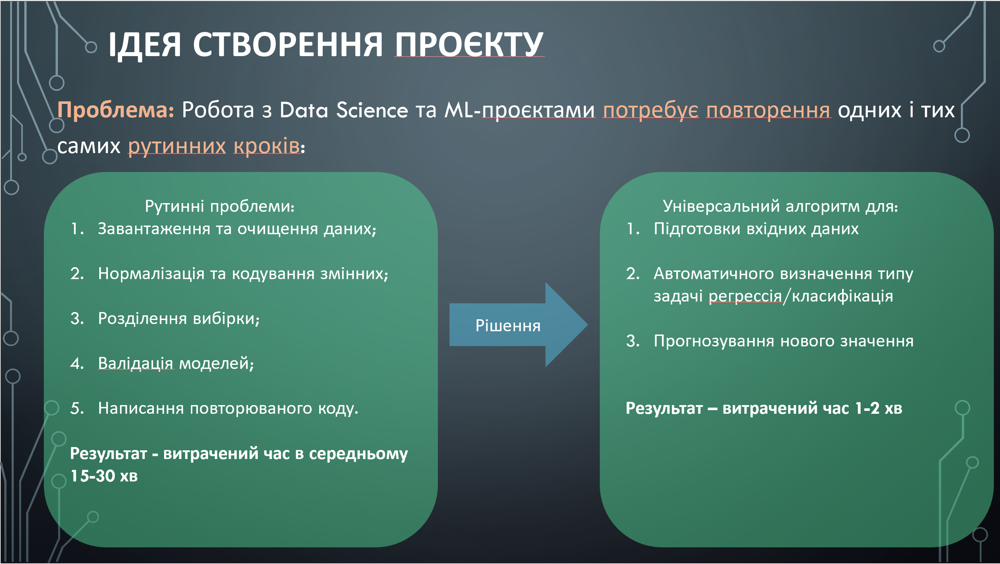
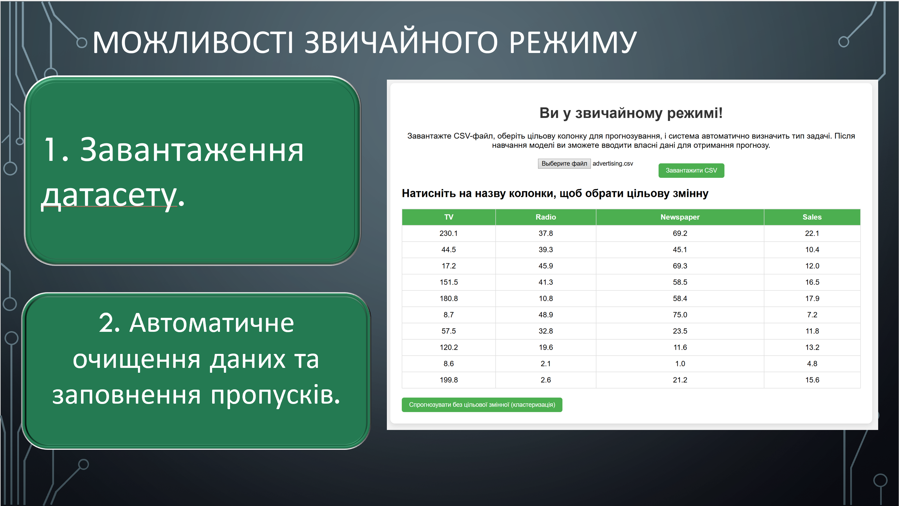
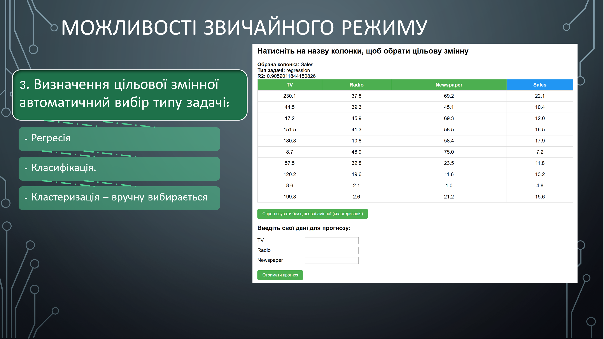
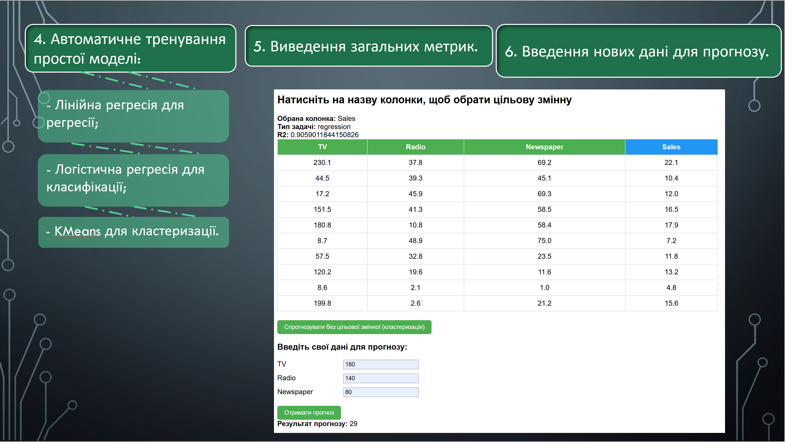
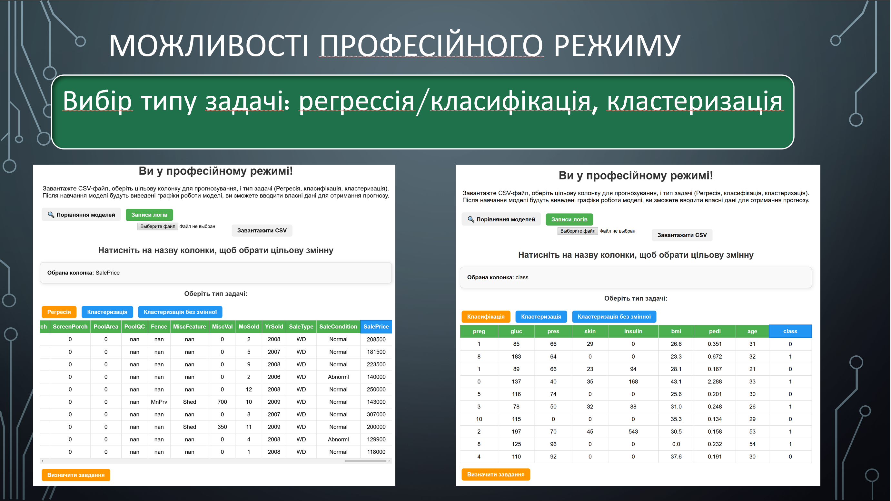
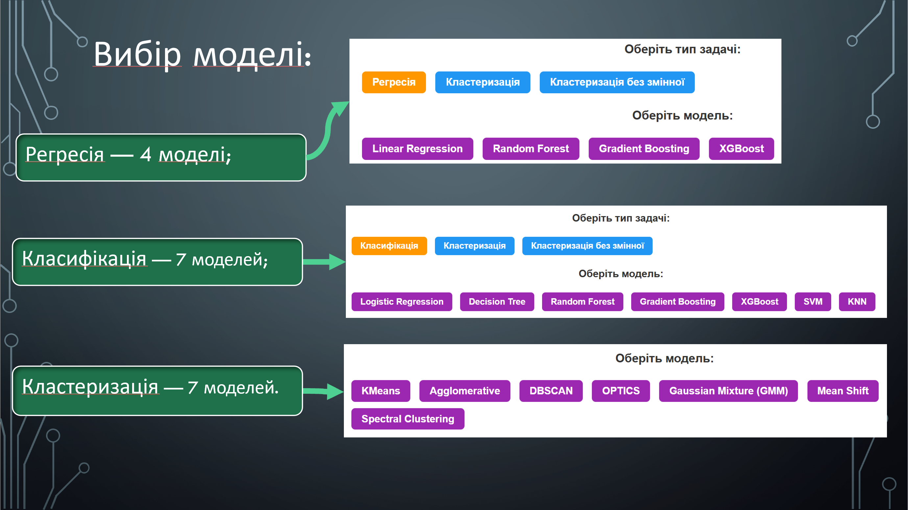
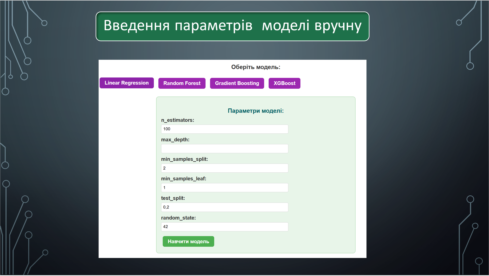
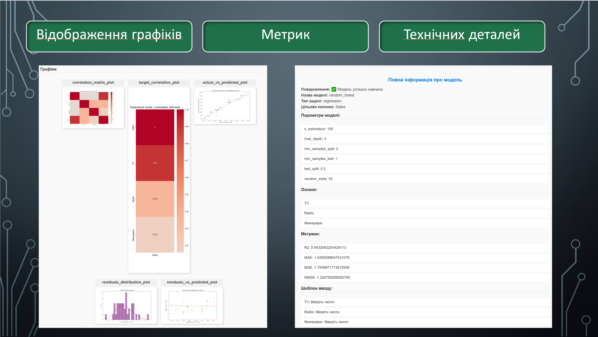
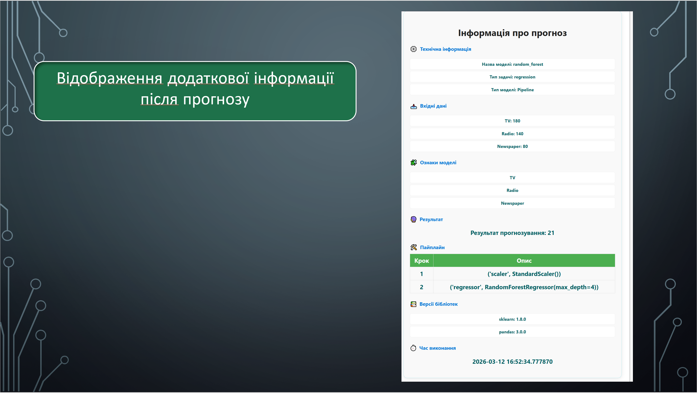
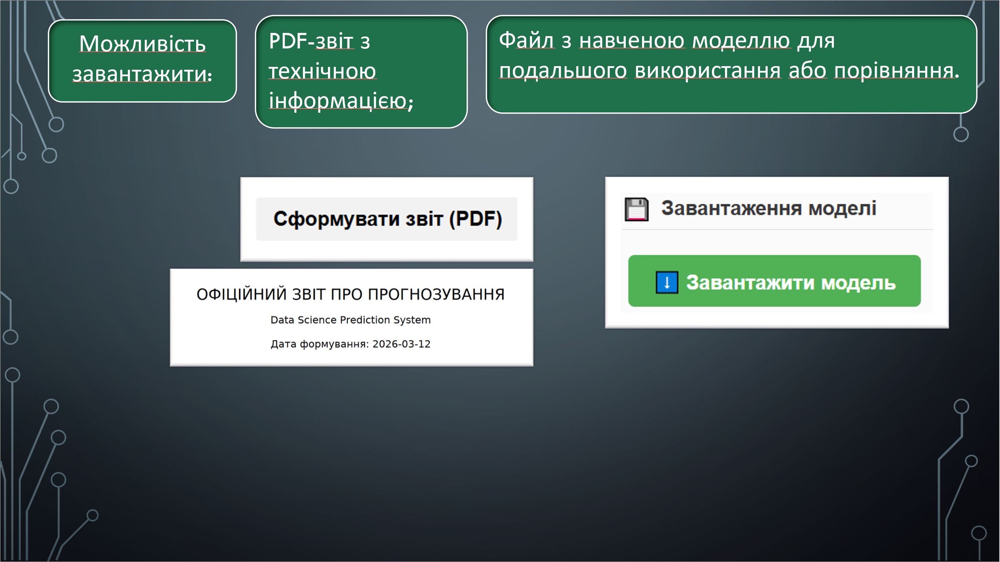

# R&D Documentation

  

  

  

  

  

  

  

  

  

  

  

# Архітектура проєкту

Сервіс побудований у вигляді модульної структури, що дозволяє легко масштабувати та додавати нові алгоритми, моделі та функціонал.  

## Основні компоненти

### 1. Шрифти
- **fonts/** — містить шрифти для веб-інтерфейсу.

### 2. Логи
- **logs/** — файли логів для бекенду (Python) та фронтенду (JavaScript):  
  - `app_debug.log` — debug-логи Python;  
  - `app_info.log` — загальні логи Python (info, warn, error);  
  - `js_debug.log` — debug-логи JavaScript;  
  - `js_info.log` — загальні логи JavaScript (info, warn, error).  

Система логування дозволяє відстежувати помилки та стан сервісу на будь-якому етапі.

### 3. Роутери
- **routers/** — FastAPI роутери:  
  - `basic_router.py` — маршрути для звичайного режиму;  
  - `router_professional.py` — маршрути для професійного режиму.  

### 4. Збережені моделі
- **saved_basic_models/** — моделі для звичайного режиму.  
- **saved_models/** — моделі для професійного режиму.  
- **uploaded_models/** — моделі, завантажені користувачем для порівняння.  

### 5. Статичні файли
- **static/** — JS та CSS файли для веб-інтерфейсу:  
  - скрипти для різних режимів;  
  - стилі для сторінок;  
  - `favicon.svg` — іконка браузера.  

### 6. HTML-шаблони
- **templates/** — HTML-шаблони для веб-інтерфейсу:  
  - `basic/` — шаблони для звичайного режиму;  
  - `professional/` — шаблони для професійного режиму;  
  - `main_index.html` — головна сторінка.  

### 7. Алгоритми для професійного режиму
- **TEST_PROF_ALGRS/** — модулі алгоритмів:  
  - **classification_algs/** — 7 моделей класифікації: Decision Tree, Gradient Boosting, KNN, Logistic Regression, Random Forest, SVM, XGBoost.  
  - **regression_algs/** — 4 моделі регресії: Linear Regression, Random Forest Regressor, Gradient Boosting Regressor, XGBoost Regressor.  
  - **clustering_algs/** — 7 алгоритмів кластеризації: Agglomerative, DBSCAN, GMM, KMeans, Mean Shift, OPTICS, Spectral Clustering.

### Центральні файли в кожній підпапці

#### main.py
- Відповідає за централізований запуск навчання моделей для відповідного типу задачі.
- Виконує:
  - автоматичну обробку даних;
  - запуск обраної моделі з параметрами;
  - керування навчанням та валідацією;
  - збереження навченої моделі у відповідну папку.
- Мета — уникнути дублювання коду для різних моделей одного типу задачі.

#### utils.py
- Містить загальні функції та алгоритми, які використовуються усіма моделями у підпапці:
  - підготовка та очищення датасету;
  - кодування категоріальних змінних;
  - нормалізація/масштабування даних;
  - розділення на навчальну та тестову вибірки;
  - побудова графіків навчання та метрик;
  - збереження моделі у пайплайн;
  - генерація звітів про навчання.

> Завдяки `utils.py` забезпечується консистентність обробки даних і повторне використання коду без дублювання.

Додатково:  
- **csv_tables/** — приклади CSV для тестування.  
- **start_task_detector.py** — визначення типу задачі.  

### 8. Навчання моделей у звичайному режимі
- **training/**:  
  - `task_detector.py` — визначення типу задачі;  
  - `train_classification.py` — навчання класифікації;  
  - `train_clustering.py` — навчання кластеризації;  
  - `train_regression.py` — навчання регресії.  

### 9. Конфігурація логерів
- **logging_config.py** — налаштування логерів Python та JavaScript.

### 10. Центральний запуск
- **main.py** — головний файл запуску FastAPI сервісу, відповідає за підключення роутерів, ініціалізацію моделей та запуск веб-сервісу.

### 11. Документація та інструкції
- **README.md** — загальний опис сервісу.  
- **MANUAL.md** — користувацький мануал.  
- **RND_DOCUMENTATION.md** — R&D документація з технічними деталями.  
- **requirements.txt** — залежності проєкту.  

# Технічна частина
## Головний роутер (main.py)

## Призначення
Центральна точка входу у сервіс. Відповідає за:
- створення FastAPI-додатку;
- підключення статичних файлів та HTML-шаблонів;
- підключення роутерів (звичайний та професійний режим);
- логування кожного веб-запиту;
- відображення головної сторінки;
- прийом повідомлень для логування з фронтенду.

## Основні компоненти
- **FastAPI** — ініціалізація додатку.  
- **StaticFiles / Jinja2Templates** — робота зі статичними файлами та шаблонами.  
- **basic_router / professional_router** — підключення режимів.  
- **logger / js_logger** — система логування для Python та JavaScript.  

## Логіка
1. Користувач заходить на `/` → повертається `main_index.html`.  
2. Запити проходять через middleware → логуються метод, URL, статус, час виконання.  
3. Виклики фронтенду на `/log` → запис повідомлень у `js_logger`.  
4. Подальша робота відбувається через:
   - `basic_router` → звичайний режим;  
   - `professional_router` → професійний режим.  

## Роутер звичайного режиму (basic_router.py)

## Призначення
Роутер відповідає за роботу у **Basic Mode**:
- завантаження датасету (CSV);
- автоматичне визначення задачі та навчання простої моделі;
- виконання прогнозів для нових даних;
- відображення результатів у веб-інтерфейсі.

## Основні компоненти
- **APIRouter** з префіксом `/basic_mode`.  
- **templates/basic/** — HTML-шаблони для інтерфейсу.  
- **basic_state** — глобальний стан (дані, модель, тип задачі, цільова змінна).  
- **run_prediction_task** — функція для автоматичного визначення задачі та навчання моделі.  
- Використовуються моделі: `LinearRegression`, `LogisticRegression`, `KMeans`.

## Логіка
1. **`GET /basic_mode/`**  
   - Відображає головну сторінку режиму.  

2. **`POST /basic_mode/upload`**  
   - Завантаження CSV-файлу.  
   - Перевірка формату.  
   - Збереження датасету у `basic_state`.  
   - Відображення прев’ю таблиці та типів колонок.  

3. **`POST /basic_mode/train`**  
   - Виклик `run_prediction_task`.  
   - Навчання моделі (регресія, класифікація, кластеризація).  
   - Збереження моделі та параметрів у `basic_state`.  
   - Виведення метрик та графіків.  

4. **`POST /basic_mode/predict-value`**  
   - Використання навченої моделі для прогнозу нових даних.  
   - Для класифікації — також повертає ймовірності класів.  
   - Для кластеризації — визначає кластер об’єкта.  

`basic_router.py` реалізує повний цикл роботи у звичайному режимі:  
**завантаження даних → навчання моделі → прогнозування нових значень**.

## Визначення типу задачі (task_detector.py)

## Призначення
Файл відповідає за автоматичне визначення типу задачі прогнозування:
- кластеризація (якщо цільова змінна не задана);
- класифікація (числова змінна з малою кількістю унікальних значень або категоріальна змінна);
- регресія (числова змінна з великою кількістю унікальних значень).

## Основні компоненти
- **run_prediction_task** — головна функція запуску задачі.  
- Використовує модулі:
  - `train_regression_model` — навчання регресії;  
  - `train_classification_model` — навчання класифікації;  
  - `train_cluster_model` — навчання кластеризації.  
- **logger** — логування процесу.

## Логіка
1. Якщо `df` не передано → читає датасет з файлу.  
2. Якщо `target` не задано → запускає кластеризацію.  
3. Якщо `target` відсутній у колонках → помилка.  
4. Визначає тип даних цільової змінної та кількість унікальних значень:  
   - числова змінна ≤ 10 унікальних значень → класифікація;  
   - числова змінна > 10 унікальних значень → регресія;  
   - категоріальна змінна → класифікація.  
5. Викликає відповідну функцію навчання.

`task_detector.py` є ключовим модулем для автоматичного вибору типу задачі та запуску відповідного процесу навчання.

## Навчання моделі регресії (train_regression.py)

## Призначення
Файл реалізує процес навчання моделі **LinearRegression** у звичайному режимі:
- попередня обробка даних;
- вибір важливих ознак;
- тренування моделі;
- обчислення метрик;
- побудова графіків;
- формування шаблону вводу для користувача.

## Основні компоненти
- **LinearRegression** — базова модель регресії.  
- **Pipeline (StandardScaler + LinearRegression)** — масштабування та навчання.  
- **Метрики**: R2, MAE, MSE, RMSE.  
- **Графіки**: кореляційна матриця, кореляція ознак з target, фактичні vs передбачені, розподіл помилок, помилки vs передбачені.  
- **prepare_user_input** — функція для перетворення вводу користувача у формат DataFrame.  
- **input_template** — автоматично сформований шаблон вводу.  
- **Збереження моделі** у `saved_basic_models/linear_model_pipeline.pkl`.

## Логіка
1. Заповнення пропусків та кодування змінних.  
2. Побудова кореляційної матриці та вибір ознак.  
3. Розділення даних на train/test.  
4. Створення та навчання Pipeline.  
5. Обчислення метрик якості моделі.  
6. Збереження моделі у файл.  
7. Побудова графіків у форматі base64.  
8. Формування шаблону вводу та функції для обробки нових даних.

`train_regression.py` забезпечує повний цикл навчання моделі регресії у звичайному режимі:  
**обробка даних → тренування → метрики → графіки → збереження моделі**.

## Навчання моделі класифікації (train_classification.py)

## Призначення
Файл реалізує процес навчання моделі **LogisticRegression** у звичайному режимі:
- попередня обробка даних;
- вибір важливих ознак;
- тренування моделі;
- обчислення метрик;
- побудова графіків;
- формування шаблону вводу для користувача.

## Основні компоненти
- **LogisticRegression** — базова модель класифікації.  
- **Pipeline (StandardScaler + LogisticRegression)** — масштабування та навчання.  
- **Метрики**: accuracy, classification_report.  
- **Графіки**: кореляційна матриця, кореляція ознак з target, матриця плутанини, ROC-криві.  
- **prepare_user_input** — функція для перетворення вводу користувача у формат DataFrame.  
- **input_template** — автоматично сформований шаблон вводу.  
- **Збереження моделі** у `saved_basic_models/logistic_model_pipeline.pkl`.

## Логіка
1. Заповнення пропусків та кодування змінних.  
2. Побудова кореляційної матриці та вибір ознак.  
3. Розділення даних на train/test зі стратифікацією.  
4. Створення та навчання Pipeline.  
5. Обчислення метрик якості моделі.  
6. Збереження моделі у файл.  
7. Побудова графіків у форматі base64.  
8. Формування шаблону вводу та функції для обробки нових даних.

`train_classification.py` забезпечує повний цикл навчання моделі класифікації у звичайному режимі:  
**обробка даних → тренування → метрики → графіки → збереження моделі.

## Навчання моделі кластеризації (train_clustering.py)

## Призначення
Файл реалізує процес навчання моделі **KMeans** у звичайному режимі:
- попередня обробка даних;
- вибір ознак;
- нормалізація;
- визначення оптимальної кількості кластерів (метод "лікоть");
- тренування моделі;
- побудова графіків;
- формування шаблону вводу для користувача.

## Основні компоненти
- **KMeans** — базова модель кластеризації.  
- **StandardScaler** — нормалізація ознак.  
- **Метод "лікоть"** — визначення оптимального числа кластерів.  
- **PCA** — візуалізація кластерів у 2D-просторі.  
- **Метрики**: кількість кластерів (`n_clusters`).  
- **Графіки**: кореляційна матриця, кореляція ознак з target, elbow-метод, PCA-візуалізація, heatmap середніх значень ознак, barplot розподілу кластерів.  
- **prepare_user_input** — функція для перетворення вводу користувача у формат DataFrame.  
- **input_template** — автоматично сформований шаблон вводу.  
- **Збереження моделі** у `saved_basic_models/kmeans_model.pkl`.

## Логіка
1. Вибір підмножини даних (до 10 000 рядків).  
2. Заповнення пропусків та кодування змінних.  
3. Побудова кореляційної матриці та вибір ознак.  
4. Нормалізація даних.  
5. Виконання методу "лікоть" для визначення оптимального k.  
6. Тренування моделі KMeans та призначення кластерів.  
7. Збереження моделі у файл.  
8. Побудова графіків у форматі base64.  
9. Формування шаблону вводу та функції для обробки нових даних.  

`train_clustering.py` забезпечує повний цикл навчання моделі кластеризації у звичайному режимі:  
**обробка даних → визначення оптимального k → тренування → графіки → збереження моделі.

# Логування на фронтенді (logger.js)

## Призначення
Файл реалізує універсальну функцію логування для JavaScript-коду на фронтенді:
- вивід повідомлень у консоль браузера;
- відправка логів на бекенд FastAPI для централізованого збереження.

## Основні компоненти
- **logger(level, message)** — головна функція логування.  
- **timestamp** — час створення повідомлення у форматі ISO.  
- **console[level]** — вивід повідомлення у консоль відповідного рівня (debug, error, warn, info).  
- **fetch("/log")** — відправка повідомлення на бекенд через POST-запит.  

## Логіка
1. Формується повідомлення з позначкою часу та рівнем логування.  
2. Виводиться у консоль браузера.  
3. Відправляється на бекенд (`/log`) для запису у систему логування.  
4. У випадку помилки відправки — повідомлення про помилку у консоль.  

`logger.js` забезпечує єдиний механізм логування для фронтенду:  
**консоль → бекенд → централізовані логи**.

## Скрипт для звичайного режиму (basic_mode.js)

## Призначення
Файл реалізує логіку роботи **Basic Mode** на фронтенді:
- вибір цільової колонки;
- тренування моделі (з target або без);
- прогнозування нових значень;
- інтеграція з бекендом через API;
- логування подій через `logger.js`.

## Основні компоненти
- **selectedColumn / featureColumns / taskType** — змінні стану для вибраної колонки, ознак та типу задачі.  
- **logger.js** — використовується для запису подій у консоль та бекенд.  
- **UI-елементи** — оновлення інтерфейсу (індикатор завантаження, кнопки, поля вводу, результати прогнозу).  

## Логіка
1. **selectColumn(element, dtype)**  
   - Виділяє колонку у таблиці.  
   - Оновлює інформацію у UI.  
   - Вмикає кнопку тренування.  
   - Логує вибір.  

2. **trainModel(noTarget = false)**  
   - Формує payload з target або без нього.  
   - Відправляє запит на `/basic_mode/train`.  
   - Отримує метрики, тип задачі, ознаки.  
   - Генерує поля вводу для прогнозу.  
   - Логує результат.  

3. **trainModelNoTarget()**  
   - Виконує кластеризацію без цільової змінної.  
   - Отримує метрики та ознаки.  
   - Генерує поля вводу.  
   - Логує результат.  

4. **predict(event)**  
   - Збирає дані з форми.  
   - Відправляє запит на `/basic_mode/predict-value`.  
   - Виводить результат прогнозу у UI (значення, ймовірності класів, дані кластерів).  
   - Логує результат або помилку.  

`basic_mode.js` забезпечує інтерактивну роботу користувача у **Basic Mode**:  
**вибір колонки → тренування моделі → прогнозування → відображення результатів у UI**.

## Роутер професійного режиму (professional_router.py)

## Призначення
Файл реалізує логіку роботи у **Professional Mode**:
- завантаження датасету;
- визначення типу задачі (класифікація, регресія, кластеризація);
- навчання моделі з параметрами;
- збереження та завантаження моделей;
- прогнозування нових даних;
- генерація PDF-звітів;
- порівняння моделей у веб-інтерфейсі.

## Основні компоненти
- **APIRouter** з префіксом `/professional_mode`.  
- **templates/professional/** — HTML-шаблони для інтерфейсу.  
- **basic_state / dataset_info** — глобальні словники для збереження стану та інформації про датасет.  
- **detect_task_type** — функція для визначення типу задачі.  
- **normalize_params** — нормалізація параметрів моделі.  
- **run_prediction_task** — запуск навчання з параметрами.  
- **reportlab** — генерація PDF-звітів.  

## Логіка
1. **`GET /professional_mode/`**  
   - Відображає головну сторінку професійного режиму.  

2. **`POST /professional_mode/upload`**  
   - Завантаження CSV-файлу.  
   - Збереження датасету у глобальний стан.  
   - Формування прев’ю та типів колонок.  

3. **`POST /professional_mode/detect_task`**  
   - Визначення типу задачі за цільовою змінною.  

4. **`POST /professional_mode/train`**  
   - Отримання параметрів моделі.  
   - Запуск `run_prediction_task`.  
   - Збереження моделі у файл (`saved_models`).  
   - Формування відповіді з метриками, ознаками, графіками.  

5. **`GET /professional_mode/download_model/{filename}`**  
   - Завантаження збереженої моделі.  

6. **`GET /professional_mode/compare_models`**  
   - Відображення сторінки порівняння моделей.  

7. **`POST /professional_mode/upload_model`**  
   - Завантаження моделі користувачем.  
   - Розпакування pickle-файлу та отримання метаданих.  

8. **`POST /professional_mode/predict`**  
   - Виконання прогнозу на основі збереженої моделі.  
   - Формування відповіді з усією інформацією (метрики, ознаки, параметри, графіки).  

9. **`POST /professional_mode/generate_report`**  
   - Генерація PDF-звіту з інформацією про модель, датасет, метрики, параметри, графіки.  

`professional_router.py` забезпечує повний цикл роботи у професійному режимі:  
**завантаження даних → визначення задачі → навчання моделі → збереження/завантаження → прогнозування → генерація звітів → порівняння моделей**.

## Запуск задачі прогнозування (start_task_detector.py)

## Призначення
Файл реалізує універсальну функцію **run_prediction_task**, яка запускає процес навчання моделі у професійному режимі:
- завантаження датасету;
- визначення типу задачі (регресія, класифікація, кластеризація);
- виклик відповідних алгоритмів;
- повернення результатів (модель, метрики, ознаки, графіки, шаблон вводу).

## Основні компоненти
- **regression_main** — запуск алгоритмів регресії.  
- **classification_main** — запуск алгоритмів класифікації.  
- **clustering_main** — запуск алгоритмів кластеризації.  
- **logger** — логування процесу.  

## Логіка
1. Якщо `df` не передано → читає датасет з файлу.  
2. Формує словник задачі (`df`, `target`, `model_name`, `params`).  
3. Викликає відповідну `main`-функцію залежно від `task_type`:  
   - **regression** → повертає pipeline, метрики, ознаки, параметри, графіки, шаблон вводу.  
   - **classification** → повертає pipeline, метрики, ознаки, параметри, графіки, шаблон вводу, encoder.  
   - **clustering** → повертає модель, мітки кластерів, графіки, шаблон вводу, X_train, метрики.  
4. У випадку невідомого типу задачі → помилка.  

`start_task_detector.py` є центральним модулем професійного режиму, який забезпечує запуск відповідних алгоритмів залежно від типу задачі та повертає повний набір результатів для подальшої роботи.

## Регресія

Файли для регресії знаходяться у директорії **`TEST_PROF_ALGRS/regression_algs`**.  
У ній розміщені основні модулі професійного режиму для задач регресії:  
- `main.py` — головна функція запуску;  
- `utils.py` — утиліти для підготовки даних та оцінки моделей;  
- папка `models` з окремими файлами для різних моделей регресії.

## Запуск моделей регресії (regression_algs/main.py)

### Призначення
Файл реалізує основну функцію **regression_main**, яка відповідає за запуск навчання моделей регресії у професійному режимі:
- приймає словник параметрів задачі;  
- викликає відповідну модель залежно від вибору користувача;  
- повертає результати навчання (pipeline, метрики, ознаки, параметри, графіки, шаблон вводу).  

### Основні компоненти
- Моделі: Linear Regression, Random Forest, Gradient Boosting, XGBoost.  
- **logger** — логування процесу.  

### Логіка
1. Отримує словник `task_dict` з даними (`df`, `target`, `model_name`, `params`).  
2. Викликає відповідну функцію `train` залежно від обраної моделі.  
3. Повертає результати: pipeline, метрики, ознаки, параметри моделі, параметри train/test split, графіки, шаблон вводу.  
4. Логує всі результати для відстеження.  

## Утиліти для моделей регресії (regression_algs/utils.py)

### Призначення
Файл містить універсальні функції для роботи з моделями регресії у професійному режимі:
- завантаження та збереження моделей;  
- підготовка датафрейму;  
- оцінка моделі та побудова графіків;  
- генерація шаблону вводу та обробка нового вводу користувача;  
- опис параметрів для моделей.  

### Основні компоненти
- **load_model(...)** — завантаження моделі з `.pkl` файлу.  
- **save_model(...)** — збереження моделі у `.pkl` файл.  
- **PARAM_DESCRIPTIONS** — словник з описами параметрів для XGBoost та Gradient Boosting.  
- **ask_param(...)** — запит параметра з перевіркою та описом.  
- **prepare_dataframe(...)** — підготовка даних: заповнення пропусків, формування X та y, вибір ознак за кореляцією.  
- **save_plot_to_base64()** — збереження графіка matplotlib у форматі base64.  
- **generate_input_template(...)** — генерація шаблону вводу для користувача.  
- **prepare_user_input(...)** — формування DataFrame для нового вводу користувача.  
- **evaluate_model(...)** — оцінка моделі за метриками (R2, MAE, MSE, RMSE) та побудова графіків.  

### Логіка
1. Завантаження/збереження моделей у форматі `.pkl`.  
2. Підготовка даних: очищення, вибір ознак, кореляційна матриця.  
3. Оцінка моделі: обчислення метрик (R2, MAE, MSE, RMSE).  
4. Побудова графіків: кореляційна матриця, фактичні vs передбачені, розподіл помилок.  
5. Формування шаблону вводу та обробка нових даних для прогнозу.  

## Моделі регресії (папка `models`)

У кожному файлі моделі реалізовано функцію **train**, яка виконує однакові процеси:
- формування параметрів моделі (дефолтні або користувацькі);  
- підготовка даних (очищення, вибір ознак, кореляційна матриця);  
- розділення даних на train/test;  
- тренування моделі у **Pipeline** (StandardScaler + модель);  
- оцінка моделі (метрики, графіки, шаблон вводу);  
- збереження моделі у `.pkl` файл;  
- повернення результатів: pipeline, метрики, ознаки, параметри, графіки, шаблон вводу.  

### Перелік файлів моделей
- `linear_model.py`  
- `random_forest_model.py`  
- `gradient_boosting_model.py`  
- `xgboost_model.py`  

## Класифікація

Файли для класифікації знаходяться у директорії **`TEST_PROF_ALGRS/classification_algs`**.  
У ній розміщені основні модулі професійного режиму для задач класифікації:  
- `main.py` — головна функція запуску;  
- `utils.py` — утиліти для підготовки даних та оцінки моделей;  
- папка `models` з окремими файлами для різних моделей класифікації.

## Запуск моделей класифікації (classification_algs/main.py)

### Призначення
Файл реалізує основну функцію **classification_main**, яка відповідає за запуск навчання моделей класифікації у професійному режимі:
- приймає словник параметрів задачі;  
- викликає відповідну модель залежно від вибору користувача;  
- повертає результати навчання (pipeline, метрики, ознаки, параметри, графіки, шаблон вводу, encoder).  

### Основні компоненти
- Моделі: Logistic Regression, Decision Tree, Random Forest, Gradient Boosting, XGBoost, SVM, KNN.  
- **logger** — логування процесу.  

### Логіка
1. Отримує словник `task_dict` з даними (`df`, `target`, `model_name`, `params`).  
2. Викликає відповідну функцію `train` залежно від обраної моделі.  
3. Повертає результати: pipeline, метрики, ознаки, параметри моделі, параметри train/test split, графіки, шаблон вводу, encoder.  
4. Логує всі результати для відстеження.  

## Утиліти для моделей класифікації (classification_algs/utils.py)

### Призначення
Файл містить універсальні функції для роботи з моделями класифікації у професійному режимі:
- завантаження та збереження моделей;  
- підготовка датафрейму;  
- оцінка моделі та побудова графіків;  
- генерація шаблону вводу та обробка нового вводу користувача;  
- опис параметрів для моделей.  

### Основні компоненти
- **load_model(...)** — завантаження моделі з `.pkl` файлу.  
- **save_model(...)** — збереження моделі у `.pkl` файл.  
- **PARAM_DESCRIPTIONS** — словник з описами параметрів для класифікаційних моделей.  
- **ask_param(...)** — запит параметра з перевіркою та описом.  
- **prepare_dataframe(...)** — підготовка даних: кодування цільової змінної, вибір ознак за кореляцією.  
- **save_plot_to_base64()** — збереження графіка matplotlib у форматі base64.  
- **generate_input_template(...)** — генерація шаблону вводу для користувача.  
- **prepare_user_input(...)** — формування DataFrame для нового вводу користувача.  
- **evaluate_model(...)** — оцінка моделі за метриками (Accuracy, Precision, Recall, F1) та побудова графіків (Confusion Matrix).  

### Логіка
1. Завантаження/збереження моделей у форматі `.pkl`.  
2. Підготовка даних: очищення, кодування цільової змінної, вибір ознак.  
3. Оцінка моделі: обчислення метрик (Accuracy, Precision, Recall, F1).  
4. Побудова графіків: матриця помилок (Confusion Matrix).  
5. Формування шаблону вводу та обробка нових даних для прогнозу.  

## Моделі класифікації (папка `models`)

У кожному файлі моделі реалізовано функцію **train**, яка виконує однакові процеси:
- формування параметрів моделі (дефолтні або користувацькі);  
- підготовка даних (очищення, кодування цільової змінної, вибір ознак);  
- розділення даних на train/test;  
- тренування моделі у **Pipeline** (StandardScaler + модель);  
- оцінка моделі (метрики, графіки, шаблон вводу);  
- збереження моделі у `.pkl` файл;  
- повернення результатів: pipeline, метрики, ознаки, параметри, графіки, шаблон вводу, encoder.  

### Перелік файлів моделей
- `decision_tree_model.py`  
- `gradient_boosting_model.py`  
- `knn_model.py`  
- `logistic_regression_model.py`  
- `random_forest_model.py`  
- `svm_model.py`  
- `xgboost_model.py`  

# Кластеризація

Файли для кластеризації знаходяться у директорії **`TEST_PROF_ALGRS/clustering_algs`**.  
У ній розміщені основні модулі професійного режиму для задач кластеризації:  
- `main.py` — головна функція запуску;  
- `utils.py` — утиліти для підготовки даних та оцінки моделей;  
- папка `models` з окремими файлами для різних алгоритмів кластеризації.

## Основна функція кластеризації (main.py)

### Призначення
Файл реалізує функцію **main**, яка відповідає за запуск задач кластеризації у професійному режимі:
- приймає словник параметрів задачі;  
- викликає відповідну модель кластеризації залежно від вибору користувача;  
- повертає результати кластеризації (модель, мітки кластерів, графіки, шаблон вводу, навчальні дані).  

### Основні компоненти
- Моделі кластеризації: **KMeans, DBSCAN, GMM, OPTICS, Mean Shift, Spectral, Agglomerative**.  
- **KNeighborsClassifier** — використовується для побудови класифікатора на основі отриманих кластерів (у випадках OPTICS, Spectral, Agglomerative).  
- **logger** — логування процесу.  

### Логіка
1. Отримання словника `task_dict` з даними (`df`, `target`, `model_name`, `params`).  
2. Виклик відповідної моделі кластеризації залежно від параметра `model_name`.  
3. Для моделей OPTICS, Spectral та Agglomerative додатково створюється KNN-класифікатор на основі отриманих кластерів.  
4. Логування результатів: кількість кластерів, ознаки, графіки, шаблон вводу.  
5. Повернення результатів: модель, мітки кластерів, графіки, шаблон вводу, навчальні дані (`X_train`).  

## Утиліти для кластеризації (utils.py)

### Призначення
Файл містить універсальні функції для роботи з моделями кластеризації у професійному режимі:
- завантаження та збереження моделей;  
- опис параметрів для різних алгоритмів;  
- попередня обробка даних;  
- генерація шаблону вводу та підготовка нового вводу користувача;  
- універсальна функція прогнозування належності нових точок до кластерів;  
- збереження графіків у форматі base64.  

### Основні компоненти
- **load_cluster_model(model_name, folder)** — завантаження моделі з `.pkl` файлу.  
- **save_cluster_model(model, model_name, features, folder)** — збереження моделі у `.pkl` файл.  
- **PARAM_DESCRIPTIONS** — словник з описами параметрів для кластеризаційних моделей.  
- **ask_param(...)** — запит параметра з перевіркою та описом.  
- **save_plot_to_base64()** — збереження графіка matplotlib у форматі base64.  
- **preprocess_data(...)** — попередня обробка даних: очищення, вибір ознак, масштабування.  
- **generate_input_template(...)** — генерація шаблону вводу для користувача.  
- **prepare_user_input(...)** — формування DataFrame для нового вводу користувача.  
- **predict_cluster(...)** — універсальна функція прогнозування для різних моделей кластеризації.  

### Логіка
1. Завантаження/збереження кластеризаційних моделей у форматі `.pkl`.  
2. Попередня обробка даних: очищення, вибір ознак, масштабування.  
3. Генерація шаблону вводу та підготовка нових даних для прогнозу.  
4. Прогнозування належності нових точок до кластерів (підтримка KMeans, GMM, DBSCAN, OPTICS).  
5. Логування всіх етапів роботи для відстеження процесу.  

## Моделі кластеризації (папка `models`)

У кожному файлі моделі реалізовано функцію **train**, яка виконує однакові процеси:
- формування параметрів моделі (дефолтні або користувацькі);  
- попередня обробка даних (масштабування, вибір ознак, кореляційна матриця);  
- навчання моделі та отримання кластерних міток;  
- збереження моделі у `.pkl` файл;  
- побудова графіків для аналізу результатів (PCA-візуалізація, heatmap, barplot, додаткові специфічні графіки залежно від моделі);  
- формування шаблону вводу для користувача;  
- повернення результатів: модель, мітки кластерів, графіки, шаблон вводу, оброблені дані.  

### Перелік файлів моделей
- `agglomerative_model.py`  
- `dbscan_model.py`  
- `gmm_model.py`  
- `kmeans_model.py`  
- `mean_shift_model.py`  
- `optics_model.py`  
- `spectral_model.py`

## CSV таблиці (TEST_PROF_ALGRS/csv_tables)

У директорії **`TEST_PROF_ALGRS/csv_tables`** зберігаються прикладні CSV-таблиці, які можна використовувати для тестування моделей у професійному режимі.  

### Особливості
- Таблиці призначені для перевірки роботи алгоритмів класифікації, регресії та кластеризації.  
- Деякі файли мають великий розмір, що може призвести до помилок під час обробки.  
- Усі помилки, пов’язані з використанням великих таблиць, можна переглянути у логах (**logger** фіксує їх автоматично).  

### Використання
- CSV-таблиці можна завантажувати у функції `train` для тестування моделей.  
- Рекомендується працювати з невеликими файлами для швидкої перевірки.  
- Для великих датасетів варто застосовувати попередню обробку або обмеження кількості рядків (наприклад, через параметри у функціях `preprocess_data`).  

# JS-скрипт для професійного режиму (professional_mode.js)

## Призначення
Файл реалізує клієнтську логіку професійного режиму роботи з моделями:
- вибір цільової колонки та визначення типу задачі;
- вибір моделі та налаштування параметрів;
- запуск тренування моделі та відображення результатів;
- прогнозування на основі введених даних;
- завантаження натренованих моделей;
- формування звітів у форматі PDF.

## Основні компоненти

### 1. Єдиний словник параметрів (**PARAMS_CONFIG**)
- Містить конфігурацію параметрів для всіх моделей (регресія, класифікація, кластеризація).  
- Для кожного параметра визначено тип, діапазон значень, дефолтне значення та можливі варіанти.  
- Використовується для динамічного формування форм у UI.

### 2. Вибір задачі та моделі
- **selectColumn** — вибір цільової колонки у таблиці.  
- **determineTask** — визначення типу задачі (регресія, класифікація, кластеризація) через бекенд.  
- **selectClusteringNoTarget** — вибір кластеризації без цільової змінної.  
- **selectTask** — вибір типу задачі та генерація кнопок для доступних моделей.  
- **showParams** — відображення параметрів моделі у формі на основі словника.  
- **collectFormParams** — збір параметрів з форми для передачі у бекенд.

### 3. Тренування моделі
- **trainModel** — відправляє запит `/professional_mode/train` з параметрами моделі.  
- Відображає результати: повідомлення, назву моделі, тип задачі, цільову колонку, параметри, ознаки, метрики, шаблон вводу, графіки.  
- Генерує форму для введення нових даних.  
- Додає кнопку для завантаження моделі у `.pkl`.

### 4. Завантаження моделі
- **downloadModel** — виконує запит `/professional_mode/download_model/{filename}`.  
- Завантажує файл моделі у форматі `.pkl` та зберігає його локально.

### 5. Прогнозування
- **predict** — відправляє запит `/professional_mode/predict` з новими даними.  
- Відображає технічну інформацію, вхідні дані, ознаки моделі, результат прогнозу (регресія, класифікація, кластеризація).  
- Генерує форму для повторного вводу даних.  
- Відображає пайплайн, версії бібліотек, час виконання.  
- Додає кнопку для формування звіту у PDF.

### 6. Додаткові функції
- **openOverlay / closeOverlay** — перегляд графіків у збільшеному вигляді.  
- **generateReport** — формування PDF-звіту через бекенд `/professional_mode/generate_report`.  

### 7. Експорт у глобальний простір
Усі основні функції (`selectColumn`, `determineTask`, `selectTask`, `showParams`, `trainModel`, `downloadModel`, `predict`, `openOverlay`, `closeOverlay`, `generateReport`) експортуються у `window` для використання у UI.

## Логіка роботи
1. Вибір цільової колонки.  
2. Визначення типу задачі.  
3. Вибір моделі та параметрів.  
4. Запуск тренування → отримання результатів (метрики, графіки, шаблон вводу).  
5. Завантаження моделі у `.pkl`.  
6. Прогнозування на основі нових даних.  
7. Формування PDF-звіту.  

**JS-скрипт забезпечує повний цикл роботи професійного режиму: від вибору задачі до отримання прогнозів та звітів.**

# JS-скрипт для сторінки логів (logs.js)

## Призначення
Файл реалізує клієнтську логіку для перегляду логів у професійному режимі:
- завантаження логів з бекенду;
- відображення логів з пагінацією;
- фільтрація за рівнем повідомлень;
- пошук у реальному часі;
- підсвічування знайдених результатів.

## Основні компоненти

### 1. Завантаження логів
- **loadLogs(type, page)** — отримує логи з бекенду `/professional_mode/logs?type={type}`.  
- Зберігає всі рядки у `allLines`.  
- Викликає функції для фільтрації, відображення та пагінації.  
- Логує дію користувача через `/log`.

### 2. Відображення логів
- **renderLogs()** — відображає логи у контейнері `#log-container`.  
- Реалізує:
  - пагінацію (відображає лише частину рядків);  
  - фільтрацію за рівнем (`INFO`, `DEBUG`, `ERROR`, `WARNING`);  
  - пошук у реальному часі з підсвічуванням знайдених слів.  

### 3. Пагінація
- **renderPagination()** — створює кнопки для переходу між сторінками.  
- Виділяє активну сторінку жирним шрифтом.  
- Дозволяє перемикати сторінки без перезавантаження.

### 4. Фільтрація
- **setupFilter(type)** — формує список рівнів логів для фільтрації.  
- Для `debug` додає рівень `DEBUG`, для інших — лише `INFO`, `WARN`, `ERROR`.  
- Прив’язує зміну фільтра до функції `renderLogs`.

### 5. Пошук
- Реалізовано через `input` подію на полі `#search-input`.  
- Пошук працює у реальному часі, підсвічує знайдені слова.

### 6. Експорт у глобальний простір
Усі основні функції (`loadLogs`, `renderLogs`, `renderPagination`, `setupFilter`) експортуються у `window` для використання у UI.

## Логіка роботи
1. Користувач обирає тип логів.  
2. Викликається `loadLogs` → отримання даних з бекенду.  
3. Відображення логів з урахуванням пагінації, пошуку та фільтрації.  
4. Користувач може перемикати сторінки, змінювати рівень фільтрації та виконувати пошук.  

**JS-скрипт забезпечує зручний перегляд логів у професійному режимі з підтримкою пошуку, фільтрації та пагінації.**

# JS-скрипт для сторінки порівняння моделей (compare_models.js)

## Призначення
Файл реалізує клієнтську логіку для завантаження та відображення інформації про збережені моделі у професійному режимі:
- завантаження моделей через форму;
- відображення метаданих моделі (тип задачі, цільова колонка, параметри, ознаки, метрики);
- показ графіків у інтерактивному режимі;
- можливість закриття/видалення картки моделі.

## Основні компоненти

### 1. Перегляд графіків
- **openOverlay(imgSrc)** — відкриває модальне вікно з графіком у збільшеному вигляді.  
- **closeOverlay()** — закриває модальне вікно.

### 2. Завантаження моделей
- Обробка форм з класом `.upload-form`.  
- При відправці форми:
  - створюється `FormData` з файлу;  
  - виконується запит `POST` на бекенд (`form.action`);  
  - отримується JSON-відповідь з метаданими моделі.

### 3. Відображення моделі
- Створюється контейнер **model-card** для кожної моделі.  
- Додається кнопка закриття (видаляє картку).  
- Відображається:
  - назва файлу;  
  - тип задачі;  
  - цільова колонка;  
  - параметри моделі;  
  - ознаки;  
  - метрики;  
  - шаблон вводу;  
  - графіки (у форматі base64, з можливістю перегляду через `openOverlay`).  

### 4. Обробка помилок
- Якщо файл не вдалося завантажити або виникла помилка при обробці, користувач отримує повідомлення через `alert`.

## Логіка роботи
1. Користувач завантажує файл моделі через форму.  
2. Скрипт відправляє запит на бекенд і отримує метадані.  
3. На сторінці створюється картка моделі з усією інформацією.  
4. Користувач може переглядати графіки у збільшеному вигляді та закривати картку моделі.  

**JS-скрипт забезпечує зручне порівняння моделей у професійному режимі, дозволяючи переглядати параметри, метрики та графіки для кожної завантаженої моделі.**

# Файл з логерами (logging_config.py)

## Призначення
Файл реалізує конфігурацію логування для професійного режиму:
- створює окремі лог-файли для Python та JS;  
- обмежує кількість рядків у кожному файлі;  
- забезпечує форматування повідомлень;  
- дозволяє одночасно писати логи у файли та консоль.  

## Основні компоненти

### 1. Папка для логів
- Автоматично створюється директорія **`logs`**.  
- У ній зберігаються всі файли логів.  

### 2. Кастомний FileHandler (**LimitedFileHandler**)
- Наслідує стандартний `logging.FileHandler`.  
- Обмежує кількість рядків у файлі (за замовчуванням — 500).  
- При перевищенні ліміту залишає лише останні рядки.  
- Очищає файл при старті.  

### 3. Формат повідомлень
- Формат: `%(asctime)s [%(levelname)s] %(name)s: %(message)s`
- Включає час, рівень логування, ім’я логера та повідомлення.  

### 4. Хендлери для Python
- **info_handler** — пише повідомлення рівня `INFO`.  
- **debug_handler** — пише повідомлення рівня `DEBUG`.  
- **console_handler** — дублює повідомлення у консоль.  

### 5. Хендлери для JS
- **js_info_handler** — пише повідомлення рівня `INFO`, але відфільтровує `DEBUG`.  
- **js_debug_handler** — пише повідомлення рівня `DEBUG`.  
- Використовується фільтр **NoDebugFilter**, щоб виключити `DEBUG` з info-логів.  

### 6. Логери
- **logger ("app")** — головний логер для Python.  
- Рівень: `DEBUG`.  
- Хендлери: `info_handler`, `debug_handler`, `console_handler`.  
- **js_logger ("js")** — логер для JS.  
- Рівень: `DEBUG`.  
- Хендлери: `js_info_handler`, `js_debug_handler`, `console_handler`.  

## Логіка роботи
1. При запуску створюється папка `logs`.  
2. Для кожного типу логів створюється окремий файл:  
 - `app_info.log`  
 - `app_debug.log`  
 - `js_info.log`  
 - `js_debug.log`  
3. Логи пишуться у файли та консоль одночасно.  
4. Кожен файл обмежений 500 рядками — старі записи автоматично видаляються.  

**Файл забезпечує централізоване та контрольоване логування для Python та JS у професійному режимі.**
